# OnlineJudge ER 图（当前项目版本）

> 数据来源：`onlinejudge-backend/scripts/*.sql` 与 `onlinejudge-backend/src/main/resources/db/migration/*.sql`

```mermaid
erDiagram
    USER {
      BIGINT id PK
      VARCHAR username
      VARCHAR password
      VARCHAR email
      VARCHAR nickname
      TEXT avatar
      VARCHAR role
      TINYINT status
      TINYINT deleted
      DATETIME create_time
      DATETIME update_time
    }

    PROBLEM {
      BIGINT id PK
      VARCHAR title
      LONGTEXT description
      TEXT input_format
      TEXT output_format
      LONGTEXT sample_input
      LONGTEXT sample_output
      TEXT hint
      INT time_limit
      INT memory_limit
      VARCHAR difficulty
      VARCHAR tags
      BIGINT creator_id
      TINYINT status
      INT ac_count
      INT submit_count
      TINYINT deleted
      DATETIME create_time
      DATETIME update_time
    }

    TEST_CASE {
      BIGINT id PK
      BIGINT problem_id FK
      LONGTEXT input
      LONGTEXT output
      TINYINT is_sample
    }

    SUBMISSION {
      BIGINT id PK
      BIGINT user_id FK
      BIGINT problem_id FK
      VARCHAR language
      LONGTEXT code
      VARCHAR status
      INT time_used
      INT memory_used
      LONGTEXT error_message
      DATETIME create_time
    }

    JUDGE_RESULT {
      BIGINT id PK
      BIGINT submission_id FK
      BIGINT user_id FK
      BIGINT problem_id FK
      VARCHAR language
      VARCHAR status
      INT time_used
      INT memory_used
      TEXT error_message
      DATETIME judge_time
      DATETIME create_time
      DATETIME update_time
    }

    CONTEST {
      BIGINT id PK
      VARCHAR title
      TEXT description
      DATETIME start_time
      DATETIME end_time
      DATETIME scoreboard_freeze_time
      INT penalty_per_wrong
      BIGINT creator_id FK
      TINYINT status
      TINYINT deleted
      DATETIME create_time
      DATETIME update_time
    }

    CONTEST_PROBLEM {
      BIGINT id PK
      BIGINT contest_id FK
      BIGINT problem_id FK
    }

    CONTEST_PARTICIPANT {
      BIGINT id PK
      BIGINT contest_id FK
      BIGINT user_id FK
      DATETIME create_time
    }

    CONTEST_SCORE {
      BIGINT id PK
      BIGINT contest_id FK
      BIGINT user_id FK
      INT rank_no
      INT accepted_count
      INT total_penalty
      INT total_submissions
      DATETIME last_accepted_time
      DATETIME create_time
      DATETIME update_time
    }

    DISCUSSION_POST {
      BIGINT id PK
      BIGINT user_id FK
      VARCHAR title
      TEXT content
      BIGINT problem_id FK
      INT view_count
      TINYINT deleted
      DATETIME create_time
      DATETIME update_time
    }

    DISCUSSION_COMMENT {
      BIGINT id PK
      BIGINT post_id FK
      BIGINT user_id FK
      BIGINT parent_comment_id FK
      TEXT content
      TINYINT deleted
      DATETIME create_time
      DATETIME update_time
    }

    SYSTEM_CONFIG {
      BIGINT id PK
      VARCHAR config_key
      TEXT config_value
      VARCHAR description
      BIGINT update_user_id FK
      DATETIME create_time
      DATETIME update_time
    }

    ADMIN_OPERATION_LOG {
      BIGINT id PK
      BIGINT operator_id FK
      VARCHAR operator_username
      VARCHAR module
      VARCHAR action
      VARCHAR target_type
      BIGINT target_id
      TEXT detail
      DATETIME create_time
    }

    STUDENT_PROFILE {
      BIGINT id PK
      BIGINT user_id FK
      VARCHAR student_no
      VARCHAR class_name
      VARCHAR major
      VARCHAR real_name
      VARCHAR gender
      VARCHAR bio
      DATETIME create_time
      DATETIME update_time
    }

    TEACHER_PROFILE {
      BIGINT id PK
      BIGINT user_id FK
      VARCHAR teacher_no
      VARCHAR department
      VARCHAR title
      VARCHAR real_name
      VARCHAR gender
      VARCHAR bio
      DATETIME create_time
      DATETIME update_time
    }

    ADMIN_PROFILE {
      BIGINT id PK
      BIGINT user_id FK
      VARCHAR admin_code
      VARCHAR real_name
      VARCHAR department
      VARCHAR bio
      DATETIME create_time
      DATETIME update_time
    }

    USER_FOLLOW {
      BIGINT id PK
      BIGINT follower_id FK
      BIGINT following_id FK
      TINYINT deleted
      DATETIME create_time
      DATETIME update_time
    }

    PRIVATE_MESSAGE {
      BIGINT id PK
      BIGINT from_user_id FK
      BIGINT to_user_id FK
      TEXT content
      TINYINT read_flag
      TINYINT deleted
      DATETIME create_time
      DATETIME update_time
    }

    %% Core
    USER ||--o{ SUBMISSION : submits
    PROBLEM ||--o{ SUBMISSION : receives
    PROBLEM ||--o{ TEST_CASE : has
    SUBMISSION ||--|| JUDGE_RESULT : judged_as
    USER ||--o{ JUDGE_RESULT : owns
    PROBLEM ||--o{ JUDGE_RESULT : targets
    USER ||--o{ PROBLEM : creates

    %% Contest
    USER ||--o{ CONTEST : creates
    CONTEST ||--o{ CONTEST_PROBLEM : includes
    PROBLEM ||--o{ CONTEST_PROBLEM : selected
    CONTEST ||--o{ CONTEST_PARTICIPANT : has
    USER ||--o{ CONTEST_PARTICIPANT : joins
    CONTEST ||--o{ CONTEST_SCORE : ranks
    USER ||--o{ CONTEST_SCORE : gets

    %% Discussion
    USER ||--o{ DISCUSSION_POST : publishes
    PROBLEM ||--o{ DISCUSSION_POST : related
    DISCUSSION_POST ||--o{ DISCUSSION_COMMENT : contains
    USER ||--o{ DISCUSSION_COMMENT : writes
    DISCUSSION_COMMENT ||--o{ DISCUSSION_COMMENT : replies

    %% System
    USER ||--o{ SYSTEM_CONFIG : updates
    USER ||--o{ ADMIN_OPERATION_LOG : operates

    %% Role profiles
    USER ||--o| STUDENT_PROFILE : student_profile
    USER ||--o| TEACHER_PROFILE : teacher_profile
    USER ||--o| ADMIN_PROFILE : admin_profile

    %% Social
    USER ||--o{ USER_FOLLOW : follows_out
    USER ||--o{ USER_FOLLOW : follows_in
    USER ||--o{ PRIVATE_MESSAGE : sends
    USER ||--o{ PRIVATE_MESSAGE : receives
```

## 说明
- 当前 SQL 主要通过 `*_id` 字段表达关联，数据库层面多数未显式加外键约束；ER 图按业务关系建模。
- 若你需要，我可以继续输出「精简版 ER 图（毕业论文插图）」和「按模块拆分版（用户/题库/竞赛/社交）」。
