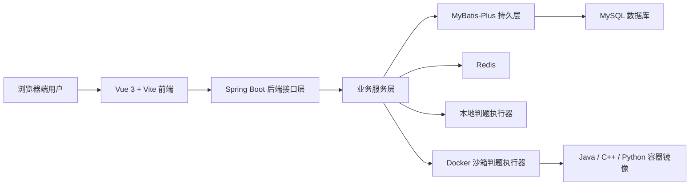
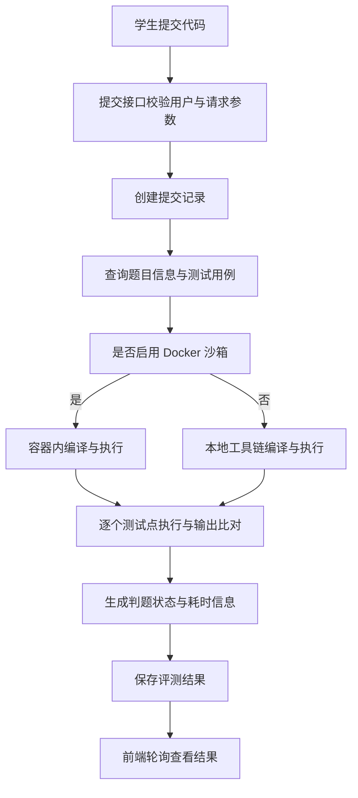
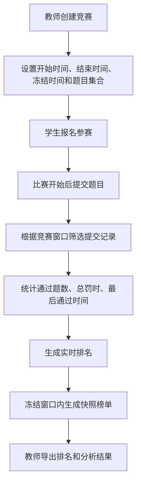
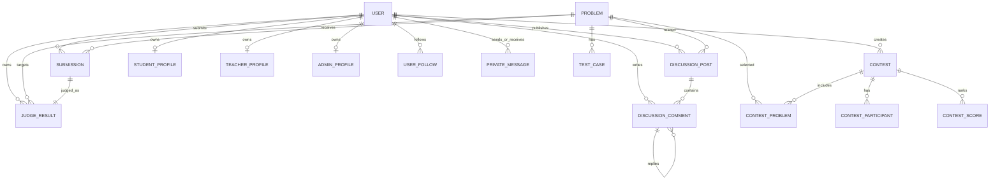
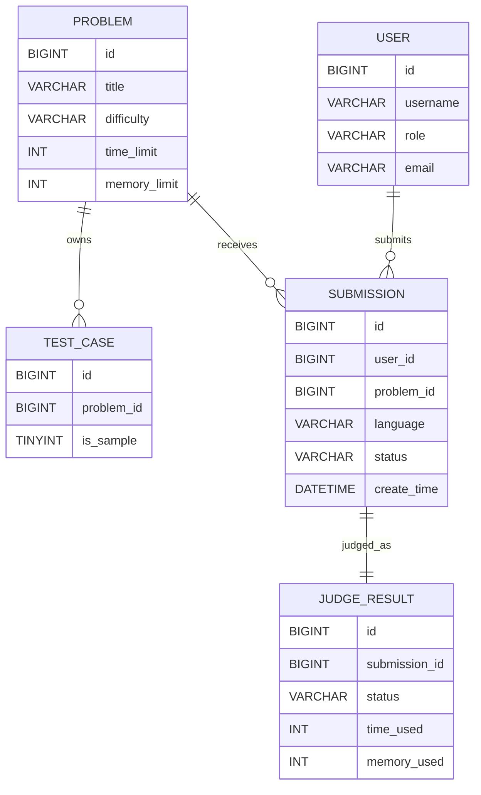

# 基于SpringBoot的程序设计评测系统的设计与实现

作者：李融荣  
学号：2240010316  
院系与专业：人工智能学院 / 计算机科学与技术（22计本3班）  
指导教师：王雅坤  
成文日期：二〇二六年四月  

## 摘要

随着高校程序设计课程教学规模的扩大以及工程实践类课程比重的提升，传统依赖教师人工批改代码、线下统计成绩和课后集中答疑的教学方式逐渐暴露出反馈周期长、评价标准不统一、过程数据难以沉淀等问题。尤其是在程序设计基础、算法设计、竞赛训练和课程实验等场景中，教师既需要快速完成大量代码提交的判定，又需要对学生的错误类型、题目掌握程度和竞赛表现进行持续跟踪。基于这一背景，设计并实现一个面向学生、教师和管理员三类角色的程序设计评测系统，具有明确的教学应用价值和工程实现意义。

本文结合唐山学院毕业设计（论文）写作规范，围绕一个基于 Spring Boot 与 Vue 技术栈构建的程序设计评测系统展开研究。系统采用前后端分离的 B/S 架构，后端以 Spring Boot 为核心框架，集成 Spring Security、JWT、MyBatis-Plus、Flyway 与 Redis，实现用户认证授权、题库管理、在线提交、判题处理、竞赛组织、讨论交流、教学分析与系统运维等功能；前端采用 Vue 3、Vite、Pinia 与 Tailwind CSS 构建交互界面，实现题库中心、赛事中枢、代码工坊、教师工作台和管理控制台等业务页面；数据库选用 MySQL 存储用户、题目、测试用例、提交记录、评测结果、竞赛信息、论坛帖子及社交关系等核心数据。

在系统设计方面，本文首先从程序设计教学与在线竞赛支持的实际需求出发，完成角色需求分析、功能结构划分和数据库建模；然后重点分析了题目管理、自动判题、竞赛排名、教师分析和管理员控制台等关键模块的实现思路。针对程序在线评测存在的安全性与资源隔离问题，系统设计了“本地判题 + Docker 沙箱判题”的双路径执行机制，并结合测试用例管理、时间限制放宽策略、排行榜快照与冻结机制，提升了系统在教学和竞赛场景下的适用性。最后，本文依据项目已有测试脚本与工程实现情况，对系统的功能测试、接口联调和性能测试方案进行了总结。

本文所实现的系统能够较好地满足程序设计课程日常练习、教师布题与成绩分析、学生竞赛报名与排名查看、管理员配置与日志审计等业务需求，为程序设计教学信息化和竞赛管理数字化提供了一套较为完整的实现方案。

关键词：Spring Boot；程序设计评测系统；在线判题；Docker 沙箱；竞赛管理

## Abstract

With the expansion of programming education in universities, the traditional workflow based on manual grading, offline statistics and delayed feedback has become increasingly inefficient. In programming courses and contest-oriented training, teachers need to evaluate code submissions quickly and consistently, while students expect timely judging results, ranking feedback and discussion support. Therefore, designing and implementing a practical programming evaluation system has clear educational and engineering value.

This thesis studies the design and implementation of a programming evaluation system built with Spring Boot and Vue. The system adopts a browser/server architecture with front-end and back-end separation. The back end is developed with Spring Boot, Spring Security, JWT, MyBatis-Plus, Flyway and Redis to provide authentication, problem management, online submission, judging, contest organization, discussion interaction, teaching analytics and system administration. The front end is implemented with Vue 3, Vite, Pinia and Tailwind CSS to build pages such as the problem hub, contest center, code studio, teacher workbench and admin console. MySQL is used to store users, problems, test cases, submissions, judge results, contests, discussion posts and social relations.

This thesis analyzes the system requirements from the perspective of students, teachers and administrators, and then proposes the overall architecture, functional decomposition and database design. Special attention is paid to several key modules, including problem management, automatic judging, contest ranking, teacher analytics and admin control. To improve execution safety and isolation, the system provides both local judging and Docker-based sandbox judging. In addition, mechanisms such as hidden test cases, time-limit scaling, ranking snapshots and frozen scoreboards are introduced to better support both teaching and contest scenarios. Finally, based on the existing project scripts and engineering implementation, the thesis summarizes the functional testing process, interface smoke tests and performance testing scheme.

The implemented system can effectively support daily programming practice, teacher-side problem publishing and analytics, student-side contest participation and ranking inquiry, and administrator-side configuration and operation log management, providing a relatively complete solution for programming education informatization.

Keywords: Spring Boot; programming evaluation system; online judge; Docker sandbox; contest management

## 第1章 绪论

### 1.1 研究背景

程序设计课程是计算机类专业的重要基础课程，其教学效果直接关系到学生的算法思维、编程能力和工程实践能力培养。在传统教学模式下，教师通常通过布置实验作业、线下检查源代码和课后汇总成绩的方式完成教学评价。这种方式在班级规模较小时尚可维持，但当课程覆盖人数增加、练习题数量上升、竞赛训练常态化后，教师在批改效率、评分一致性与数据追踪方面都会面临较大压力。

与此同时，学生对编程训练平台的需求也在不断升级。除了完成基本的题目浏览、代码编写与结果反馈之外，学生还希望系统能够提供实时评测、错误信息展示、个人提交记录、竞赛榜单、讨论交流和学习成长轨迹等功能。教师则更关注题目发布、测试数据维护、成绩统计、排行榜导出和教学分析等能力。管理员则需要从系统运行层面保障用户管理、权限控制、配置维护、日志审计和判题过程监控的稳定性。由此可见，一个面向多角色、多场景的程序设计评测系统已经成为程序设计教学数字化的重要支撑工具。

近年来，随着 Web 应用开发技术的持续成熟，Spring Boot、Vue、MySQL、Redis 与 Docker 等技术在教学管理、在线服务和轻量化部署场景中得到了广泛应用。通过前后端分离架构构建在线评测系统，不仅可以提升开发效率，还能增强系统的模块化程度和可维护性；通过容器化沙箱实现评测隔离，也能够更好地兼顾安全性与可扩展性。因此，以现代 Web 技术为基础，构建一套可服务于程序设计教学、竞赛训练和学习交流的在线评测系统，具有现实可行性和较高应用价值。

### 1.2 国内外研究现状

从已有研究与工程实践来看，在线评测系统的建设主要集中在三个方向。第一类是面向程序设计竞赛的在线测评平台，重点关注代码自动编译执行、结果判定、排行榜生成和竞赛公平性维护。此类研究通常强调评测效率、标准化判题和竞赛组织能力，对程序设计评测系统的核心机制提供了重要参考。第二类是面向课程教学的程序设计训练平台，关注学生自主练习、教师布题管理、结果分析和教学反馈等功能，希望通过自动评测减轻教师负担并提升学习效率。第三类则进一步结合教学管理系统、分析看板与社交讨论模块，将在线评测平台从单一“判题工具”扩展为综合型学习支持平台。

在技术演进方面，早期在线评测系统多采用单体式 Web 架构，判题过程与业务过程耦合程度较高。随着 Spring Boot 等框架的普及，后端服务开发效率明显提升，角色权限、接口组织和工程配置管理更加规范；随着 Vue 等前端框架的成熟，系统界面的响应式交互、模块化页面组织和状态管理能力得到增强；随着 Docker 技术应用于代码执行环境，评测过程的运行隔离、资源限制与语言环境统一配置也更加易于实现。这些变化使得面向高校教学场景开发在线评测系统具有了更好的工程基础。

现有研究虽然已经从不同角度探索了程序设计评测平台的设计方法，但仍存在一些不足。一方面，部分系统偏重题目评测本身，缺乏教师分析、管理审计或竞赛组织等配套能力；另一方面，一些教学系统虽然具备角色划分和界面管理功能，但在在线判题隔离、安全控制和运行状态观测方面考虑不足。针对这些问题，本文结合课程教学、竞赛管理与系统运维三类需求，对程序设计评测系统进行综合设计与实现，以形成更完整的业务闭环。

### 1.3 研究内容与目标

本文研究对象为一个基于 Spring Boot 的程序设计评测系统。系统围绕学生、教师和管理员三类角色展开设计，目标是在同一平台内完成题目管理、在线编程、代码提交与判题、竞赛创建与排名、教学分析、讨论互动以及系统管理等核心任务。结合现有项目源码，本文将研究内容归纳为以下几个方面。

第一，完成系统需求分析与总体设计，梳理角色功能边界、业务流程和系统部署方式。第二，研究自动判题模块的实现机制，分析 Java、C++、Python 三类语言的编译与运行流程，以及本地判题和 Docker 沙箱判题之间的切换逻辑。第三，围绕题库中心、赛事中枢、代码工坊、教师工作台和管理控制台等业务页面，分析前后端接口与交互设计。第四，构建符合论文写作规范的数据库模型、流程图和 E-R 图，对关键数据表及其关系进行说明。第五，总结系统测试方案，包括后端功能测试、前后端联调烟雾测试与性能测试脚本设计。

从实现目标来看，本文希望达到以下几点：一是能够支持学生完成注册登录、题目练习、代码提交、结果查询、竞赛参与和讨论交流；二是能够支持教师完成题目发布、测试用例维护、竞赛组织、成绩导出和数据分析；三是能够支持管理员完成用户管理、系统配置、日志审计、判题结果观测与论坛审核；四是通过容器化沙箱和权限控制机制，提高系统运行的安全性与工程可维护性。

### 1.4 论文组织结构

全文共分为五章。第 1 章为绪论，说明课题背景、研究现状、研究内容和论文结构。第 2 章介绍系统所采用的开发环境与关键技术。第 3 章从角色需求、功能结构、总体架构和数据库设计四个方面给出系统总体设计方案。第 4 章是全文重点，对各核心模块的详细设计与实现过程进行阐述。第 5 章结合现有工程脚本与测试思路，对系统测试方案进行总结。最后给出结论、参考文献、致谢和附录。

## 第2章 相关技术与开发环境

### 2.1 开发环境

本系统采用前后端分离的 B/S 架构。后端项目位于 `onlinejudge-backend`，前端展示层统一以 `onlinejudge-frontend-v2` 作为当前实现口径。结合项目说明文档和配置文件，系统开发环境与运行依赖如表 2.1 所示。

表2.1 系统开发与运行环境

| 项目 | 配置 |
|---|---|
| 操作系统 | Windows 开发环境，支持浏览器访问 |
| 后端框架 | Spring Boot 2.7.18 |
| JDK 版本 | Java 17 |
| 构建工具 | Maven 3.8+ |
| 数据库 | MySQL 8.0 |
| 缓存组件 | Redis 6+ |
| 前端框架 | Vue 3 + Vite + Pinia |
| UI 与样式 | Tailwind CSS、shadcn-vue |
| 旧版前端 | Vue CLI + Element Plus |
| 判题运行环境 | javac、java、g++、python |
| 容器化环境 | Docker Desktop |

系统后端默认运行端口为 `8082`，接口根路径为 `/api`。前端开发环境通过环境变量将请求转发至 `http://localhost:8082/api`。从部署角度看，这种配置方式有利于降低环境耦合程度，也便于后续做本地演示与答辩环境搭建。

### 2.2 后端关键技术

后端采用 Spring Boot 作为核心开发框架，其优势在于自动配置能力较强、工程结构清晰、生态成熟，适合快速搭建面向 REST 接口的业务系统。项目在控制层中按照业务边界划分了用户、题目、提交、竞赛、讨论、社交、系统配置和教师分析等控制器；在服务层中分别实现业务逻辑；在持久层中结合 MyBatis-Plus 完成实体映射、条件查询与分页查询，从而形成较为规范的三层结构。

在安全方面，系统引入 Spring Security 与 JWT 令牌机制处理登录态与接口鉴权。控制器中通过 `SecurityUtils.requireRole` 和 `SecurityUtils.requireAnyRole` 对教师、管理员和普通学生的访问范围进行限制，从而保证题目创建、竞赛管理、后台配置和论坛审核等敏感操作只对具备相应权限的用户开放。在系统工程化方面，项目结合 Flyway 管理数据库迁移脚本，使题库、竞赛、论坛、判题结果、角色档案和社交模块的数据结构能够随版本迭代持续演进。

### 2.3 前端关键技术

当前前端展示层主要采用 Vue 3、Vite、Pinia 和 Vue Router 构建。Vue 3 提供组合式 API 和组件化开发方式，便于将题库、竞赛、登录、个人中心、教师分析和管理控制台拆分为独立页面组件；Pinia 用于管理用户信息与全局状态；Vue Router 负责角色相关路由守卫，例如教师工作台需要 `TEACHER` 或 `ADMIN` 角色，管理员控制台则要求 `ADMIN` 角色。

与旧版前端相比，`onlinejudge-frontend-v2` 更强调页面组织和业务视觉表达。系统首页、题库中心、赛事中枢、交流广场、代码工坊、教师工作台和管理控制台等页面命名更加贴近业务场景，也更适合用于论文中的功能展示和截图说明。前端通过 Axios 与后端接口通信，实现题目列表加载、提交状态轮询、竞赛排名查询、分析数据导出、论坛审核与消息收发等功能。

### 2.4 判题与容器化技术

程序设计评测系统的核心在于代码自动评测。该项目支持 Java、C++ 和 Python 三类语言，判题流程包括源代码写入、编译执行、测试用例读取、输出比对、状态生成与资源统计等步骤。后端通过 `JudgeServiceImpl` 组织本地判题逻辑，通过 `DockerSandboxJudgeExecutor` 实现容器化判题逻辑。系统能够根据配置判断是否启用 Docker 沙箱，并在沙箱失败且 `strict=false` 时自动回退到本地判题，从而兼顾安全性与可用性。

在沙箱执行过程中，系统对容器施加了 `--network none`、`--read-only`、`--cap-drop ALL`、`--memory`、`--cpus`、`--pids-limit` 与 `tmpfs` 等限制，以降低恶意代码对宿主环境造成影响的风险。对于竞赛与教学场景常见的边界问题，系统还提供了时间限制放宽策略、额外时间补偿、隐藏测试用例优先判定和重判机制，使评测结果更贴近真实教学需要。

### 2.5 本章小结

本章从开发环境、后端技术、前端技术和容器化判题技术四个方面说明了系统实现所依赖的关键技术栈。总体来看，Spring Boot 与 Vue 的组合能够较好地支撑多角色 Web 业务开发，MyBatis-Plus 与 Flyway 有助于提高数据库演化效率，Docker 沙箱则为在线判题场景下的代码隔离提供了基础保障，为后续系统设计与实现分析奠定了技术基础。

## 第3章 系统需求分析与总体设计

### 3.1 可行性分析

从技术可行性角度看，本系统所使用的 Spring Boot、Vue、MySQL、Redis 和 Docker 等技术均具有成熟的文档和广泛的实践经验，能够满足在线评测系统对角色权限、数据管理、前后端分离、代码执行隔离和系统部署的要求。项目源码中已经实现了题目管理、竞赛管理、讨论区、教师分析与系统监控等模块，说明技术方案具备较强可落地性。

从经济可行性角度看，系统运行依赖主要集中在开源技术栈上，开发工具与运行环境成本较低。在教学场景中，学校或实验室通常已具备基本的数据库、Redis 和 Docker 环境，因此系统部署成本可控。与此同时，系统能够通过自动判题与成绩分析降低教师重复性劳动，也具备较高的使用价值。

从操作可行性角度看，系统界面按角色划分明确。学生侧聚焦题目练习、竞赛参与与结果查询，教师侧聚焦题目、竞赛和分析看板，管理员侧聚焦配置、日志与审计。功能入口清晰，适合课程教学与演示答辩场景使用。

### 3.2 角色需求分析

依据开题报告与现有项目实现，系统面向学生、教师和管理员三类角色，不同角色的功能需求如表 3.1 所示。

表3.1 角色功能需求概览

| 角色 | 主要功能需求 |
|---|---|
| 学生 | 注册登录、浏览题库、在线提交、查看评测结果、参加竞赛、查看榜单、编辑个人资料、参与讨论、关注用户、收发私信 |
| 教师 | 登录、题目创建与修改、测试用例维护、竞赛创建与编辑、查看实时排名与快照排名、导出分析数据、查看教学概览 |
| 管理员 | 用户管理、角色档案维护、系统配置维护、操作日志查看、系统监控、论坛审核、判题结果观测 |

从需求角度进一步细分，学生最关注评测反馈的及时性、题目练习的连续性和竞赛结果的透明度；教师最关注题目组织效率、竞赛规则设置以及班级层面的数据分析；管理员则更关注系统稳定运行、敏感操作留痕与平台整体内容治理。因此，系统在设计时既要保证基础评测链路通畅，也要兼顾管理侧与分析侧能力建设。

### 3.3 系统总体架构设计

系统采用典型的前后端分离架构。前端负责页面展示、状态管理与接口调用，后端负责权限校验、业务处理和数据持久化，数据库负责结构化数据存储，Redis 提供缓存与辅助支持，Docker 沙箱负责受限代码执行。系统总体架构如图 3.1 所示。


图3.1 系统总体架构图

在这一结构中，前端通过 REST 接口访问后端资源，后端根据用户身份分发不同业务逻辑。题目列表、用户资料、讨论区和竞赛信息等普通数据直接由业务服务层处理；代码提交则需要进一步进入判题模块，通过本地工具链或 Docker 沙箱完成编译与执行；教师分析和管理员监控则会基于数据库中的提交记录、竞赛数据和系统配置进行聚合计算。

### 3.4 功能结构设计

结合项目现有页面与控制器划分，可以将系统功能概括为用户与权限、题库与测试用例、在线评测、竞赛管理、讨论与社交、教师分析和后台管理七个功能域。系统功能结构如图 3.2 所示。

```mermaid
flowchart TD
    A["程序设计评测系统"] --> B["用户与权限模块"]
    A --> C["题库与测试用例模块"]
    A --> D["在线评测模块"]
    A --> E["竞赛管理模块"]
    A --> F["讨论与社交模块"]
    A --> G["教师分析模块"]
    A --> H["后台管理模块"]

    B --> B1["注册登录"]
    B --> B2["JWT 认证"]
    B --> B3["角色档案"]

    C --> C1["题目列表"]
    C --> C2["题目详情"]
    C --> C3["批量导入"]
    C --> C4["测试用例管理"]

    D --> D1["代码提交"]
    D --> D2["状态轮询"]
    D --> D3["本地判题"]
    D --> D4["Docker 沙箱判题"]
    D --> D5["重判"]

    E --> E1["竞赛创建"]
    E --> E2["竞赛报名"]
    E --> E3["实时排名"]
    E --> E4["快照排名"]
    E --> E5["分析与导出"]

    F --> F1["帖子管理"]
    F --> F2["评论回复"]
    F --> F3["点赞审核"]
    F --> F4["关注私信"]

    G --> G1["教学概览"]
    G --> G2["状态分布"]
    G --> G3["语言分布"]
    G --> G4["趋势导出"]

    H --> H1["用户管理"]
    H --> H2["系统配置"]
    H --> H3["操作日志"]
    H --> H4["系统监控"]
    H --> H5["判题结果观测"]
```


图3.2 系统功能结构图

### 3.5 关键业务流程设计

系统最核心的业务流程是学生提交代码后进入判题，并向前端返回结果状态。该流程既涉及用户身份校验，也涉及题目与测试用例查询、编译执行、结果比对和状态更新。提交流程如图 3.3 所示。


图3.3 在线判题业务流程图

竞赛模块需要在普通题库练习基础上增加报名、时间窗口控制、排行榜统计与冻结机制。系统在竞赛排名计算时，会对提交记录按竞赛时间区间进行过滤，并结合罚时与通过时间生成排名结果。竞赛流程如图 3.4 所示。


图3.4 竞赛管理业务流程图

### 3.6 数据库设计

根据后端实体类、SQL 脚本和迁移文件，系统数据库覆盖了用户、题目、测试用例、提交记录、判题结果、竞赛、竞赛题目、竞赛参与者、竞赛积分、讨论帖子、评论、系统配置、操作日志、角色档案以及社交关系等核心对象。整体上，数据库设计具有以下特点：其一，以 `user` 表为中心构建学生、教师和管理员三个角色档案；其二，以 `problem`、`test_case`、`submission` 和 `judge_result` 组成题目与判题主链路；其三，以 `contest` 系列表实现竞赛组织与排名快照；其四，以 `discussion_post`、`discussion_comment`、`user_follow` 与 `private_message` 实现讨论与社交扩展。

系统全量 E-R 关系如图 3.5 所示。


图3.5 系统全量E-R图

考虑到论文插图的可读性，正文中还需要提供一个聚焦核心判题链路的精简 E-R 图，如图 3.6 所示。


图3.6 核心判题链路E-R图

在核心表设计中，`problem` 表保存题目描述、时间限制、空间限制、难度和标签等属性；`test_case` 表保存样例与隐藏测试数据；`submission` 表记录用户代码提交信息；`judge_result` 表保存最终判题状态与耗时结果。与此同时，`contest_score` 表用于固化排行榜快照结果，避免每次展示都进行全量重算。主要数据表说明如表 3.2 所示。

表3.2 核心数据表说明

| 表名 | 作用 | 关键字段 |
|---|---|---|
| user | 保存平台用户基础信息 | username、password、role、status |
| problem | 保存题目信息 | title、description、difficulty、time_limit |
| test_case | 保存测试用例 | problem_id、input、output、is_sample |
| submission | 保存代码提交记录 | user_id、problem_id、language、status、create_time |
| judge_result | 保存判题结果 | submission_id、status、time_used、memory_used |
| contest | 保存竞赛基础信息 | title、start_time、end_time、scoreboard_freeze_time |
| contest_score | 保存竞赛排名快照 | rank_no、accepted_count、total_penalty |
| discussion_post | 保存讨论区帖子 | user_id、title、content、problem_id |
| system_config | 保存系统配置项 | config_key、config_value |
| admin_operation_log | 保存敏感操作日志 | operator_id、module、action、detail |

### 3.7 本章小结

本章围绕系统需求与总体设计展开分析，给出了角色需求、总体架构、功能结构、业务流程和数据库设计。通过这些设计可以看出，该系统不仅满足题目练习与代码判题的基本需求，还进一步扩展了竞赛、讨论、社交、分析和后台运维能力，为后续详细设计与实现提供了清晰的结构基础。

## 第4章 系统详细设计与实现

### 4.1 用户与认证模块设计

用户与认证模块是系统所有业务的入口。项目后端通过 `AuthController` 提供登录、注册和退出接口，通过 Spring Security 统一处理认证链路，并使用 JWT 保存身份信息。普通学生完成注册后，可以进入题库练习和竞赛报名流程；教师和管理员则基于角色信息获取题目管理、分析看板和后台控制台权限。

在权限控制实现上，系统通过 `SecurityUtils` 对角色访问进行统一判断。例如教师或管理员才能创建题目、管理测试用例和创建竞赛，管理员才能进入系统配置、日志和判题监控功能。这种方式避免了前端仅靠路由限制带来的安全风险，使角色边界在后端接口层得到强制执行。

[此处插入截图：登录页面]

[此处插入截图：注册页面]

[此处插入截图：个人中心页面]

认证模块在实现中还强调了角色档案扩展。除基础 `user` 表外，系统还维护了 `student_profile`、`teacher_profile` 和 `admin_profile` 三张扩展表，用于保存学号、班级、专业、工号、职称、部门等信息。这使系统不仅能处理登录与访问控制，还能为教师分析和后台用户管理提供更细粒度的信息基础。

### 4.2 题库与测试用例模块设计

题库模块是学生使用频率最高的业务模块之一。学生可以在题库中心查看题目标题、难度、标签与通过状态，并进一步进入题目详情页查看题目描述、输入输出说明、样例数据和提示信息。教师和管理员则可以在管理端创建题目、修改题目内容、设置时间与空间限制，并通过测试用例模块维护样例和隐藏数据。

从源码实现来看，`ProblemController` 提供了题目列表查询、按 ID 获取题目、创建题目、批量导入题目、更新题目和删除题目等接口。`ProblemServiceImpl` 在创建和更新题目时，会同步维护样例测试用例，并在批量导入时限制单次导入题目数量，避免大规模导入对系统稳定性造成影响。系统还支持教师或管理员通过 `includeHidden=true` 查看隐藏题目，从而适配教学准备阶段的题库维护需求。

[此处插入截图：题库中心页面]

[此处插入截图：题目详情页面]

为了提高教学场景下的可维护性，系统提供了题目批量导入能力，并允许通过结构化数据一次性导入多道题目及其隐藏测试数据。这一能力在实验课程集中布题、竞赛训练批量上题和题库迁移过程中具有较强实用价值。测试用例设计上，系统将样例与隐藏数据分离存储，其中样例可直接展示在题面中，隐藏数据则用于最终判定，有助于提升评测公平性。

表4.1 题库模块关键接口说明

| 接口 | 方法 | 作用 |
|---|---|---|
| `/problem/list` | GET | 按分页、难度、关键词查询题目 |
| `/problem/{id}` | GET | 获取题目详情 |
| `/problem` | POST | 创建题目 |
| `/problem/batch-import` | POST | 批量导入题目 |
| `/problem/{id}` | PUT | 更新题目 |
| `/problem/{id}` | DELETE | 删除题目 |
| `/problem/{problemId}/test-cases` | GET/POST/PUT/DELETE | 管理测试用例 |

### 4.3 在线评测与判题模块设计

在线评测模块是系统的核心模块。学生在代码工坊中完成代码输入后，系统将根据题目约束与所选语言生成一次新的提交记录，并进入判题逻辑。`SubmissionController` 中的 `/submission/submit` 接口先进行提交频率限制检查，再调用 `SubmissionService` 完成提交流程。前端则通过 `/submission/{id}/status` 轮询获取最新评测状态，实现从 `PENDING`、`JUDGING` 到 `ACCEPTED`、`WRONG_ANSWER` 等状态的动态刷新。

[此处插入截图：代码工坊页面]

判题实现分为本地判题与 Docker 沙箱判题两条路径。`JudgeServiceImpl` 会先根据配置和环境状态判断是否启用 `DockerSandboxJudgeExecutor`，若容器可用则优先在容器内编译与运行代码；若容器不可用且系统设置为非严格模式，则自动回退到宿主机工具链执行，从而保证系统在资源受限环境下仍可完成教学演示。针对不同语言，系统分别调用 `javac/java`、`g++` 和 `python` 运行时完成评测。

```java
if (dockerSandboxJudgeExecutor.isEnabled()) {
    try {
        return dockerSandboxJudgeExecutor.judge(submission, problem, testCases);
    } catch (Exception e) {
        if (dockerSandboxJudgeExecutor.isStrict()) {
            submission.setStatus(Constants.STATUS_RUNTIME_ERROR);
            return submission;
        }
    }
}
```

上述逻辑体现了系统在安全隔离与可用性之间的平衡：在理想环境下优先采用容器化评测，在环境不完整时保留本地执行兜底。另一方面，系统还对判题过程中的多个边界细节进行了处理，例如：

1. 当题目存在隐藏测试数据时，优先使用隐藏测试点进行正式判定。
2. 当测试点为空时，可回退到题面样例，保证基础题目也能运行。
3. 对题目时间限制增加比例放宽与额外毫秒补偿，降低环境抖动造成的误判。
4. 对内存限制同时兼容 KB 与 MB 两种来源格式，减少外部题库导入时的兼容问题。
5. 记录每个测试点的输入预览、期望输出、实际输出和错误说明，便于学生定位问题。

容器沙箱模块则进一步加强了执行隔离。`DockerSandboxJudgeExecutor` 在运行容器时设置只读根文件系统、禁网、能力裁剪、PID 限制、CPU 配额、内存限制和临时文件系统挂载，从而控制不可信代码的运行边界。与单纯在本地执行代码相比，这种实现方式更适合评测系统实际部署。

### 4.4 竞赛管理与排名模块设计

竞赛管理模块用于支持课程练习赛、阶段训练赛和答辩演示赛等场景。教师或管理员可以创建竞赛，配置标题、描述、开始时间、结束时间、冻结时间、罚时规则和题目集合。学生在竞赛开放后可进行报名并查看实时榜单。系统不仅提供常规实时排名，还提供快照榜单和导出功能，便于教师在竞赛过程中控制信息暴露范围。

`ContestController` 中提供了竞赛列表、竞赛详情、创建、更新、删除、报名、实时排名、快照排名、分析与导出等接口。`ContestServiceImpl` 在计算榜单时，会先根据竞赛窗口筛选提交记录，再按照通过题数、总罚时、最后通过时间和用户 ID 进行排序，从而得到最终排名结果。系统还设计了 `scoreboard_freeze_time` 字段，当比赛进入冻结区间时，普通参赛者看到的是冻结后的榜单，教师和管理员则可通过快照查看完整结果。

[此处插入截图：赛事中枢页面]

[此处插入截图：竞赛详情与排行榜页面]

```java
sorted.sort(Comparator
        .comparingInt((Map.Entry<Long, UserStats> entry) -> entry.getValue().acceptedCount).reversed()
        .thenComparingInt(entry -> entry.getValue().totalPenalty)
        .thenComparing(entry -> entry.getValue().lastAcceptedTime, Comparator.nullsLast(Comparator.naturalOrder()))
        .thenComparingLong(Map.Entry::getKey));
```

上述排序逻辑保证了竞赛排名符合常见 ACM/ICPC 类规则，即优先比较通过题数，再比较罚时，最后根据最后通过时间等条件细化排序。这种实现既满足程序设计竞赛的常见需求，也使系统能够在教学演示中展示“实时榜单”和“冻结榜单”两种视角。

### 4.5 讨论区与社交模块设计

为了增强系统的学习支持能力，项目在传统 OJ 基础上引入了讨论区和轻量社交模块。学生可以围绕题目发布帖子、查看详情、发表评论并进行点赞互动；系统管理员可对帖子进行审核与删除操作。与此同时，项目还实现了关注关系、私信会话和消息已读更新功能，使平台从“单纯做题”扩展为“练习 + 讨论 + 互动”的综合学习空间。

`DiscussionController` 负责帖子列表、帖子详情、帖子发布、帖子删除、审核与点赞逻辑；`DiscussionCommentController` 负责评论与回复；`SocialController` 则负责关注状态查询、关注与取关、消息发送、会话列表与已读处理等操作。这类功能对于活跃学习氛围、促进学生交流和丰富系统展示面均有积极作用。

[此处插入截图：交流广场页面]

[此处插入截图：消息中心页面]

在数据库层面，系统通过 `discussion_post`、`discussion_comment`、`user_follow` 和 `private_message` 等表完成数据组织。与一般 OJ 平台相比，该系统将讨论与社交视为正式业务模块，而不是简单附属功能，这也使其更适合课程项目或毕业设计场景的综合展示。

### 4.6 教师分析模块设计

教师分析模块主要服务于课程组织和教学评估。`TeacherAnalyticsController` 提供了教学概览查询与 CSV 导出接口，后台服务 `TeacherAnalyticsServiceImpl` 则对学生总数、教师总数、题目总量、提交总量、通过率、竞赛数量、帖子数量、状态分布、语言分布以及最近若干天的提交趋势进行统计聚合。

教师工作台页面通过图卡、柱形比例条、趋势折线图和表格等方式展示分析结果，便于教师快速了解学生练习活跃度、常用编程语言、状态分布与整体通过率。这一模块将原本分散在数据库中的运行数据整合为可视化信息，有利于教师从“单次批改”转向“持续观察”。

[此处插入截图：教师工作台页面]

从实现方式上看，教师分析模块并未依赖复杂的大数据平台，而是通过对提交记录和竞赛记录进行分段计数与比例计算实现轻量级统计。这种设计既满足毕业设计项目的实现深度要求，也兼顾了工程复杂度与可维护性。

### 4.7 管理控制台设计

管理控制台承担系统运维与平台治理职责。管理员可以在控制台中完成用户查询、角色编辑、密码重置、角色档案维护、系统配置修改、日志查询、论坛审核、系统监控和判题结果观测等操作。相比仅保留用户管理的后台页面，该系统的管理控制台功能更完整，能够体现项目在平台治理和工程运维方向上的扩展思考。

`AdminSystemController` 提供了系统配置、操作日志、系统监控和判题结果查询接口；`UserController` 则承担管理员对用户账号和角色档案的维护能力；前端 `AdminConsoleView.vue` 将这些接口集中整合为统一工作台。对于毕业设计论文而言，该模块既能体现权限控制设计，也能体现系统工程化和可运维性。

[此处插入截图：管理员控制台页面]

### 4.8 关键实现特性总结

综合来看，系统详细设计具有以下几个实现特点：

1. 采用前后端分离架构，接口层次清晰，便于独立演化前端与后端。
2. 以角色权限为主线组织业务边界，保证教师与管理员功能安全可控。
3. 在线评测模块兼顾本地执行和容器隔离，提高了判题可用性与安全性。
4. 竞赛模块引入快照榜单和冻结机制，使系统更贴近真实竞赛规则。
5. 教师分析、论坛审核和判题观测等扩展功能增强了系统的综合应用价值。

### 4.9 本章小结

本章从用户认证、题库管理、在线评测、竞赛组织、讨论社交、教师分析和后台管理等方面，对系统详细设计与实现过程进行了说明。相较于仅实现题目列表与提交判题的基础 OJ 项目，本文所研究系统在角色功能完整性、工程扩展性和教学适配性方面具有更明显优势，因此第 4 章也成为全文篇幅最大的核心章节。

## 第5章 系统测试

### 5.1 测试环境与测试目标

为验证系统功能正确性与运行稳定性，项目提供了较为完整的测试与验收脚本。后端支持 `mvn test` 进行控制器与服务层测试，前端支持烟雾测试与竞赛端到端测试脚本，项目根目录还提供了一键验收脚本，用于串联后端检查、前端构建与烟雾测试流程。结合项目文档，测试环境主要包括 JDK 17、Maven、Node.js、MySQL、Redis 和 Docker Desktop。

本系统测试的主要目标包括以下三个方面：第一，验证登录、题目浏览、代码提交、结果查看、竞赛报名和后台管理等核心功能链路是否正常；第二，验证教师分析、论坛帖子与判题结果观测等扩展功能是否可达；第三，验证在最小部署方案下系统的可运行性和性能测试脚本的可执行性。

### 5.2 功能测试设计

结合项目源码和测试脚本，本系统可将功能测试划分为用户认证测试、题库与测试用例管理测试、提交与判题测试、竞赛测试、讨论区测试、教师分析测试和管理员后台测试。功能测试示例如表 5.1 所示。

表5.1 核心功能测试用例示例

| 编号 | 测试内容 | 输入与操作 | 预期结果 |
|---|---|---|---|
| T1 | 用户登录 | 输入合法账号密码 | 返回令牌并跳转首页 |
| T2 | 浏览题库 | 访问题库中心与题目详情 | 正常展示题目信息 |
| T3 | 代码提交 | 提交合法代码到指定题目 | 生成提交记录并返回评测状态 |
| T4 | 状态轮询 | 查询指定提交状态 | 返回 PENDING、JUDGING 或最终结果 |
| T5 | 竞赛报名 | 对开放竞赛执行报名 | 成功写入报名记录 |
| T6 | 排行榜查询 | 查询竞赛实时榜单 | 返回按规则排序的榜单数据 |
| T7 | 教师分析 | 查询教学概览 | 返回总量、分布和趋势数据 |
| T8 | 管理配置 | 修改站点配置项 | 配置保存成功并记录日志 |

后端测试文档表明，项目已覆盖认证、用户管理、题目提交、讨论区、教学分析、竞赛和系统控制器等多个方向的测试类。从工程实现角度看，这些测试有助于保障接口演化过程中的行为稳定性，也为论文中的系统测试章节提供了素材基础。

### 5.3 烟雾测试与端到端验证

在功能测试之外，项目还提供了两个具有代表性的前端烟雾测试脚本：其一是通用核心链路测试，覆盖登录、用户信息、题目列表与详情、竞赛列表与详情、提交列表、讨论列表以及管理员接口校验；其二是竞赛端到端脚本，覆盖竞赛创建、报名、实时榜单查询、快照榜单查询和删除清理等流程。系统还在根目录提供了一键验收脚本，用于将后端检查、前端构建和烟雾测试串联执行。

根据最小部署文档，系统可以在 Windows 单机环境中完成“登录—浏览题目—提交代码—查看评测结果—创建竞赛—查看后台”的演示链路。这说明该系统不仅适合课程项目开发，也适合毕业设计答辩场景下的集中演示。

### 5.4 性能测试方案

项目在 `onlinejudge-backend/scripts/perf` 目录下提供了基于 k6 的性能烟雾测试脚本，用于验证登录、题目列表、题目详情和竞赛列表等接口在并发访问场景下的响应表现。文档中给出了推荐的负载阶段与验收阈值，例如以逐步升高并发用户数的方式观察 `http_req_failed` 和 `http_req_duration` 的变化情况，并以失败率低于 2%、95 分位响应时间低于 800ms 作为参考目标。

虽然性能测试结果与部署环境、数据库状态和容器资源配置存在直接关系，但从测试方案设计来看，该项目已经具备基础性能验证能力。对于教学型系统而言，这种轻量级性能测试方式能够帮助开发者快速发现接口热点与瓶颈问题，为后续优化提供依据。

### 5.5 本章小结

本章围绕系统测试展开分析，说明了功能测试、烟雾测试、端到端验证和性能测试方案。总体来看，项目不仅实现了较完整的业务功能，还提供了配套测试脚本和最小部署文档，为系统答辩演示和后续维护提供了良好基础。

## 结论

本文围绕“基于 Spring Boot 的程序设计评测系统的设计与实现”这一课题，结合当前项目源码与开题报告要求，完成了系统需求分析、总体设计、详细设计与测试方案总结。研究结果表明，采用 Spring Boot、MyBatis-Plus、MySQL、Redis、Vue 3 与 Docker 等技术，可以较好地构建一套面向学生、教师和管理员三类角色的程序设计评测平台。系统在题库管理、在线评测、竞赛组织、教学分析、讨论互动和后台运维等方面形成了较完整的业务闭环，能够满足程序设计教学与竞赛训练的主要需求。

从工程实现角度看，本文所设计系统的亮点主要体现在三个方面：一是判题模块同时支持本地执行与 Docker 沙箱执行，提高了系统在不同部署环境下的适应能力；二是竞赛模块引入冻结榜单、快照排名与导出功能，使平台更贴近真实比赛场景；三是教师分析与管理员控制台将统计、监控、审计和内容治理能力纳入系统整体设计，提高了项目的综合应用价值。

当然，系统仍有进一步完善空间。例如，当前讨论区审核策略仍偏向基础功能，尚可继续引入敏感内容检测与异常行为识别；判题模块虽然已支持 Java、C++ 和 Python 三种语言，但在异步队列化执行、分布式判题与更细粒度资源统计方面仍可继续优化；教师分析模块也可继续扩展班级维度、题目知识点维度和长期成长维度分析。后续工作可围绕这些方向持续迭代，使系统在实际教学环境中发挥更大作用。

## 参考文献

[1] 钟耀章, 桂琼. ACM竞赛在线测评系统设计与实现[J]. 无线互联科技, 2020(18).

[2] 安宇鑫. 基于SpringBoot+Vue的教学评价专家抽课系统的设计与实现[J]. 电脑知识与技术, 2024.

[3] 基于Vue和Spring Boot的C语言程序在线测评系统的设计与实现[J]. 唐山师范学院学报, 2023(03).

[4] 基于Spring Boot的课程评价系统设计与实现[J]. 计算机应用研究, 2024(01).

[5] 范佳杰, 王金庆, 刘钦. 编程考试系统代码质量度量及相似度检测子系统的设计与实现[D]. 南京: 南京大学, 2020.

[6] 尤枫, 史晟辉, 赵瑞莲. 编译程序在线评测系统的实现[J]. 实验室研究与探索, 2010, 29(12):69-72.

[7] 中华人民共和国国家质量监督检验检疫总局, 中国国家标准化管理委员会. 信息与文献 参考文献著录规则: GB/T 7714—2015[S]. 北京: 中国标准出版社, 2015.

[8] 中华人民共和国国家标准局. 科学技术报告、学位论文和学术论文的编写格式: GB/T 7713—1987[S]. 北京: 中国标准出版社, 1987.

[9] The Spring Team. Spring Boot Reference Documentation 2.7.18[EB/OL]. https://docs.spring.io/spring-boot/docs/2.7.18/reference/html/.

[10] Vue.js Team. Vue.js Guide[EB/OL]. https://vuejs.org/guide/introduction.html.

[11] Docker Inc. Docker Documentation[EB/OL]. https://docs.docker.com/.

[12] baomidou. MyBatis-Plus Official Documentation[EB/OL]. https://baomidou.com/.

## 致谢

在本次毕业设计与论文撰写过程中，我对程序设计评测系统从需求分析、功能实现到论文整理的全过程有了更加系统的认识。感谢指导教师在选题、技术路线和论文结构方面给予的耐心指导，帮助我逐步明确课题目标与实现重点。感谢同学与朋友在项目测试、问题讨论和资料整理过程中提供的帮助，使我能够不断发现问题并改进实现方案。也感谢学校提供的学习环境与实践机会，使我能够将课堂知识应用到具体的软件系统开发之中。最后，感谢自己在整个毕业设计阶段保持持续投入与不断完善的态度，使本课题得以顺利完成。

## 附录

### 附录A 图表与截图说明

1. 正文中的 Mermaid 图源码将在附件文档中统一收录。
2. 当前主稿已经预留登录页、题库中心、代码工坊、赛事中枢、交流广场、消息中心、教师工作台和管理员控制台截图位置。
3. 若后续补充真实运行截图，可直接替换正文中的截图占位，不影响章节结构与图号编号。
